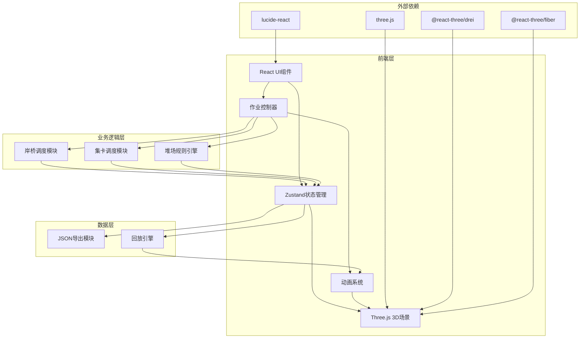
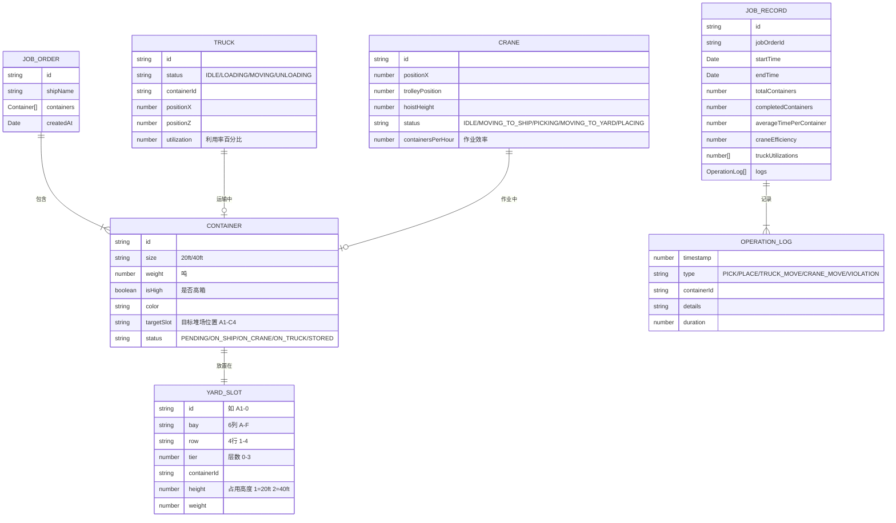

## 1. 架构设计



## 2. 技术描述

- **前端框架**：React@18 + TypeScript + Vite
- **状态管理**：Zustand（轻量、高性能）
- **3D引擎**：three.js + @react-three/fiber + @react-three/drei
- **动画库**：@tweenjs/tween.js（作业动画控制）
- **样式方案**：TailwindCSS@3
- **图标库**：lucide-react
- **后端**：无（纯前端应用）
- **数据库**：无（使用内置Mock数据，导出为本地JSON文件）

## 3. 路由定义

| 路由 | 页面组件 | 用途 |
|-------|---------|-------|
| `/` | `HomePage` | 主界面，包含3D场景和所有控制面板 |

## 4. 数据模型

### 4.1 数据模型定义



### 4.2 TypeScript类型定义

```typescript
// Container.ts
export type ContainerSize = '20ft' | '40ft';
export type ContainerStatus = 'PENDING' | 'ON_SHIP' | 'ON_CRANE' | 'ON_TRUCK' | 'STORED';

export interface Container {
  id: string;
  size: ContainerSize;
  weight: number;
  isHigh: boolean;
  color: string;
  targetSlot: string;
  status: ContainerStatus;
  shipPosition: { x: number; z: number };
}

// Yard.ts
export interface YardSlot {
  id: string;
  bay: number; // 0-5 (6列)
  row: number; // 0-3 (4行)
  tier: number; // 0-3 (4层)
  containerId: string | null;
  height: number; // 1 = 20ft, 2 = 40ft
  weight: number;
}

export type YardGrid = YardSlot[][][]; // [bay][row][tier]

// Truck.ts
export type TruckStatus = 'IDLE' | 'LOADING' | 'MOVING_TO_CRANE' | 'MOVING_TO_YARD' | 'UNLOADING' | 'RETURNING';

export interface Truck {
  id: string;
  status: TruckStatus;
  containerId: string | null;
  position: { x: number; z: number };
  targetPosition: { x: number; z: number } | null;
  totalOperationTime: number;
  totalIdleTime: number;
}

// Crane.ts
export type CraneStatus = 'IDLE' | 'MOVING_TO_SHIP' | 'PICKING' | 'MOVING_WITH_LOAD' | 'PLACING_ON_TRUCK' | 'MOVING_FROM_TRUCK' | 'PLACING_IN_YARD';

export interface Crane {
  id: string;
  positionX: number;
  trolleyPosition: number; // 0-1 相对位置
  hoistHeight: number; // 0-1 相对高度
  spreaderAttached: boolean;
  status: CraneStatus;
  currentContainerId: string | null;
  containersCompleted: number;
  totalWorkTime: number;
}

// Job.ts
export interface JobOrder {
  id: string;
  shipName: string;
  containers: Container[];
  createdAt: Date;
}

export type OperationType = 'CRANE_MOVE_TO_SHIP' | 'CRANE_PICK' | 'CRANE_MOVE_WITH_LOAD' | 'CRANE_PLACE_ON_TRUCK' | 'TRUCK_MOVE_TO_CRANE' | 'TRUCK_LOAD' | 'TRUCK_MOVE_TO_YARD' | 'TRUCK_UNLOAD' | 'CRANE_MOVE_FROM_TRUCK' | 'CRANE_PLACE_IN_YARD' | 'VIOLATION_WARNING' | 'JOB_COMPLETE';

export interface OperationLog {
  timestamp: number;
  type: OperationType;
  containerId?: string;
  truckId?: string;
  details: string;
  duration: number;
}

export interface JobRecord {
  id: string;
  jobOrderId: string;
  startTime: number;
  endTime?: number;
  totalContainers: number;
  completedContainers: number;
  containerTimes: Record<string, number>;
  craneEfficiency: number; // 箱/小时
  truckUtilizations: Record<string, number>;
  logs: OperationLog[];
}

// Store.ts
export interface SimulationState {
  isPlaying: boolean;
  isPaused: boolean;
  currentTime: number;
  playbackSpeed: number;
  mode: 'EDIT' | 'PLAYING' | 'REPLAY';
  selectedJobOrderId: string | null;
  jobOrders: JobOrder[];
  currentJobRecord: JobRecord | null;
  yardGrid: YardGrid;
  trucks: Truck[];
  crane: Crane;
  activeContainers: Container[];
  violationMessage: string | null;
}
```

## 5. 核心模块设计

### 5.1 目录结构

```
src/
├── components/
│   ├── ui/               # UI基础组件（按钮、面板、进度条等）
│   ├── scene/            # 3D场景组件
│   │   ├── PortScene.tsx     # 主场景
│   │   ├── Crane.tsx         # 岸桥模型
│   │   ├── Container.tsx     # 集装箱模型
│   │   ├── Truck.tsx         # 集卡模型
│   │   ├── Yard.tsx          # 堆场模型
│   │   ├── Ship.tsx          # 船舶模型
│   │   └── Sea.tsx           # 海面环境
│   ├── JobPanel.tsx          # 作业单面板
│   ├── MonitorPanel.tsx      # 监控面板
│   ├── ControlPanel.tsx      # 控制面板
│   ├── StatsPanel.tsx        # 统计面板
│   └── ViolationModal.tsx    # 违规警告弹窗
├── hooks/
│   ├── useCraneAnimation.ts  # 岸桥动画Hook
│   ├── useTruckDispatcher.ts # 集卡调度Hook
│   ├── useYardValidator.ts   # 堆场规则校验Hook
│   └── useReplayEngine.ts    # 回放引擎Hook
├── store/
│   └── useSimulationStore.ts # Zustand状态管理
├── types/
│   └── index.ts              # TypeScript类型定义
├── utils/
│   ├── yardUtils.ts          # 堆场工具函数
│   ├── animationUtils.ts     # 动画工具函数
│   ├── exportUtils.ts        # 导出工具函数
│   └── mockData.ts           # Mock作业单数据
├── pages/
│   └── HomePage.tsx          # 主页面
├── App.tsx
├── main.tsx
└── index.css
```

### 5.2 堆场规则校验逻辑

```typescript
// useYardValidator.ts 核心规则
export function validatePlacement(
  slot: YardSlot,
  container: Container,
  yardGrid: YardGrid
): { valid: boolean; message?: string } {
  const bay = slot.bay;
  const row = slot.row;
  const targetTier = slot.tier;
  
  // 规则1: 底层必须先放置
  if (targetTier > 0) {
    const belowSlot = yardGrid[bay][row][targetTier - 1];
    if (!belowSlot.containerId) {
      return { valid: false, message: "必须先放置底层集装箱" };
    }
  }
  
  // 规则2: 高箱不能压矮箱（高箱指40尺或isHigh=true）
  if (targetTier > 0) {
    const belowSlot = yardGrid[bay][row][targetTier - 1];
    const belowContainer = findContainerById(belowSlot.containerId!);
    const isBelowHigh = belowContainer?.size === '40ft' || belowContainer?.isHigh;
    const isCurrentHigh = container.size === '40ft' || container.isHigh;
    
    if (!isBelowHigh && isCurrentHigh) {
      return { valid: false, message: "违规：高箱不能压在矮箱上面" };
    }
  }
  
  // 规则3: 同一列重量由上到下递减
  if (targetTier > 0) {
    const belowSlot = yardGrid[bay][row][targetTier - 1];
    if (belowSlot.weight < container.weight) {
      return { valid: false, message: `违规：重量(${container.weight}吨)不能大于下方箱子(${belowSlot.weight}吨)` };
    }
  }
  
  // 规则4: 40尺箱需要占用两个相邻列位置（简化处理）
  if (container.size === '40ft') {
    // 检查相邻列是否有冲突
    if (bay < 5) {
      const adjacentSlot = yardGrid[bay + 1][row][targetTier];
      if (adjacentSlot.containerId) {
        return { valid: false, message: "40尺箱需要占用两列空间，相邻位置已被占用" };
      }
    } else {
      return { valid: false, message: "40尺箱不能放在最后一列" };
    }
  }
  
  return { valid: true };
}
```

### 5.3 集卡调度算法

```typescript
// useTruckDispatcher.ts 核心调度逻辑
export function dispatchTruck(
  trucks: Truck[],
  pickPosition: { x: number; z: number },
  dropPosition: { x: number; z: number },
  containerId: string
): Truck | null {
  // 优先选择空闲且距离最近的集卡
  const idleTrucks = trucks.filter(t => t.status === 'IDLE');
  
  if (idleTrucks.length === 0) {
    // 没有空闲集卡，寻找即将完成作业的集卡
    const busyTrucks = trucks.filter(t => t.status !== 'IDLE');
    if (busyTrucks.length === 0) return null;
    
    // 预估完成时间，选择最快空闲的
    // ... 复杂调度逻辑
    return null;
  }
  
  // 计算距离，选择最近的空闲集卡（避免空驶优化）
  let bestTruck: Truck | null = null;
  let minCost = Infinity;
  
  for (const truck of idleTrucks) {
    // 空驶距离 + 重载距离
    const deadheadDistance = calculateDistance(truck.position, pickPosition);
    const loadedDistance = calculateDistance(pickPosition, dropPosition);
    const totalCost = deadheadDistance * 1.5 + loadedDistance; // 空驶权重更高
    
    if (totalCost < minCost) {
      minCost = totalCost;
      bestTruck = truck;
    }
  }
  
  return bestTruck;
}
```
