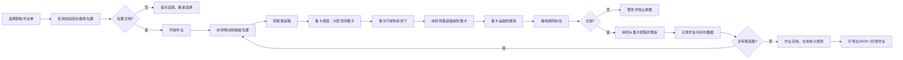

## 1. 产品概述

港口集装箱码头装卸作业3D模拟系统，基于Three.js实现沉浸式的集装箱码头作业仿真。系统模拟岸桥起重机、集卡运输车、堆场堆垛的完整作业流程，支持作业单管理、动画控制、规则校验和作业回放。

- **核心目标**：提供可视化的港口作业模拟，辅助教学演示、作业流程优化分析
- **目标用户**：港口物流专业学生、码头调度人员、物流系统分析师
- **市场价值**：低成本、可交互的作业仿真平台，无需真实设备即可演练复杂作业场景

## 2. 核心功能

### 2.1 用户角色
| 角色 | 注册方式 | 核心权限 |
|------|----------|----------|
| 操作员 | 无需注册 | 选择作业单、控制作业流程、导出记录、回放作业 |

### 2.2 功能模块
1. **3D场景模块**：港口环境、岸桥起重机、集装箱堆场（6x4区域）、集卡运输车、船舶模型
2. **作业单管理**：选择卸船作业单（10个集装箱），配置尺寸（20/40尺）和目标堆场位置
3. **作业动画控制**：岸桥移动、抓取、放下集装箱的完整动画流程
4. **集卡调度系统**：3辆集卡资源分配、路径规划、避免空驶优化
5. **堆场规则校验**：高箱不能压矮箱、同列重量由上到下递减、违规警告阻止
6. **实时监控面板**：作业进度、移动耗时、岸桥效率（箱/小时）、集卡利用率
7. **数据导出与回放**：作业记录导出JSON、按时间步长回放整个装卸过程

### 2.3 页面详情
| 页面名称 | 模块名称 | 功能描述 |
|-----------|-------------|---------------------|
| 主界面 | 3D场景视图 | Three.js渲染的港口码头全景，支持鼠标旋转、缩放、平移 |
| 主界面 | 作业单选择面板 | 下拉选择作业单，显示10个集装箱的详细信息（尺寸、重量、目标位置） |
| 主界面 | 作业控制面板 | 开始/暂停/重置作业按钮，回放速度控制 |
| 主界面 | 实时监控面板 | 进度条、当前作业集装箱信息、各箱耗时统计 |
| 主界面 | 效率统计面板 | 岸桥作业效率、集卡利用率、总耗时统计 |
| 主界面 | 违规警告提示 | 违反堆垛规则时弹出警告，阻止违规操作 |

## 3. 核心流程

## 4. 用户界面设计

### 4.1 设计风格
- **主色调**：深海蓝 (#0F2B46) 作为背景主色，工业橙 (#FF7A00) 作为强调色，浅灰蓝 (#E8F1F8) 作为面板背景
- **辅助色**：成功绿 (#22C55E)、警告红 (#EF4444)、信息蓝 (#3B82F6)
- **按钮风格**：扁平化设计，4px圆角，悬停时有轻微上浮和阴影效果
- **字体**：标题使用 "Oswald"（工业感无衬线），正文使用 "Inter"（清晰易读）
- **布局风格**：深色3D场景居中，四周环绕半透明信息面板（左上作业单、右上实时监控、底部控制栏）
- **图标**：使用 Lucide 图标库，工业风格线条图标

### 4.2 页面设计概述
| 页面名称 | 模块名称 | UI元素 |
|-----------|-------------|-------------|
| 主界面 | 3D场景区域 | 占满中央区域，Three.js Canvas，支持OrbitControls鼠标交互，作业对象高亮动画 |
| 主界面 | 作业单面板 | 左上固定位置，半透明玻璃态背景，下拉选择器，集装箱列表卡片 |
| 主界面 | 监控面板 | 右上固定位置，进度环形图，数据指标卡片，当前作业高亮 |
| 主界面 | 控制面板 | 底部固定位置，开始/暂停/重置按钮组，回放速度滑块，导出按钮 |
| 主界面 | 违规警告 | 居中模态弹窗，红色警告图标，违规详情说明，确认按钮 |

### 4.3 响应式
- 桌面端优先设计（最低1280px宽度）
- 信息面板采用固定定位，3D场景自适应剩余空间
- 触摸设备支持双指缩放和单指旋转场景

### 4.4 3D场景指引
- **环境**：黄昏港口场景，使用渐变天空（橙红到深蓝），海面使用ShaderMaterial实现波纹动画，远处有集装箱船轮廓
- **光照**：主光源使用DirectionalLight模拟夕阳，HemisphereLight提供环境光，岸桥添加点光源模拟作业灯
- **相机**：初始位置俯瞰整个码头（PerspectiveCamera，fov=60），支持OrbitControls交互，限制最大/最小缩放距离
- **材质**：集装箱使用标准化颜色代码（20尺蓝色、40尺橙色），金属部分使用MeshStandardMaterial带金属度和粗糙度
- **动画**：岸桥移动采用Tween.js缓动动画，集卡行驶有轮胎旋转效果，抓取动作有吊起/放下的弹性动画
- **后处理**：添加Bloom效果使作业灯光晕更真实，FXAA抗锯齿
- **性能**：模型保持低多边形，集装箱使用InstancedMesh优化渲染，目标帧率60fps
